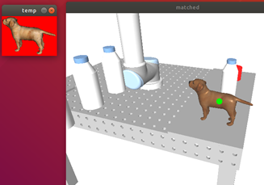
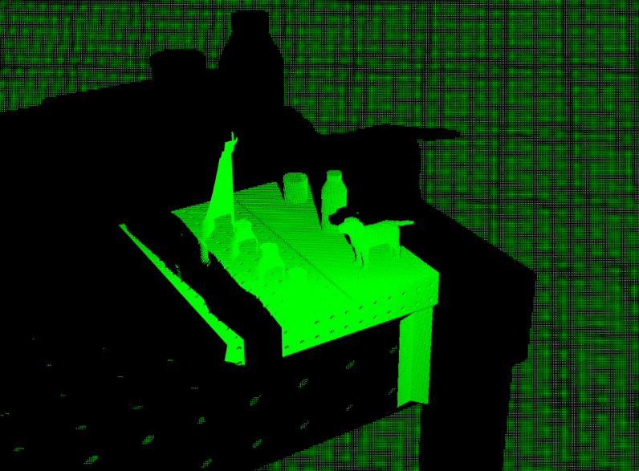
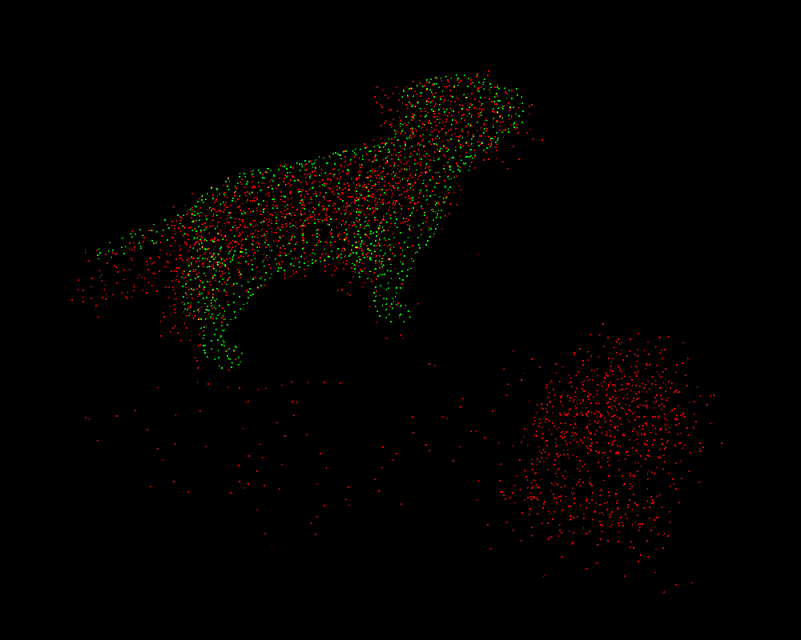
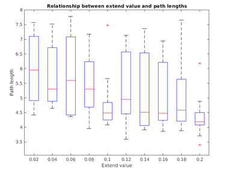
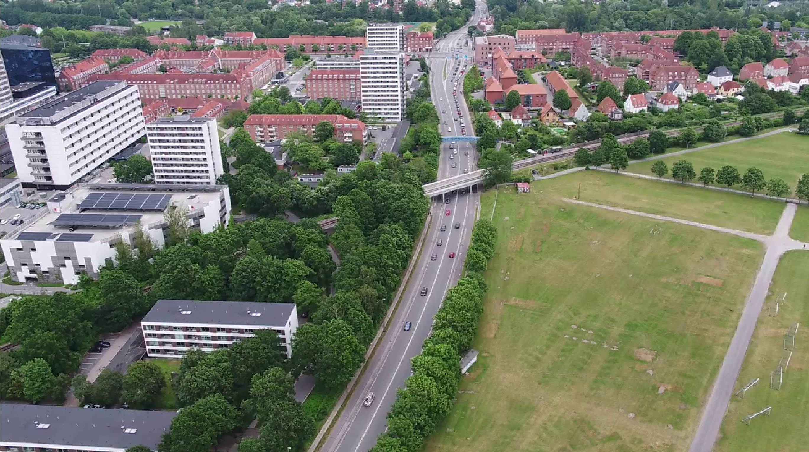
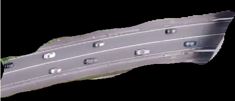
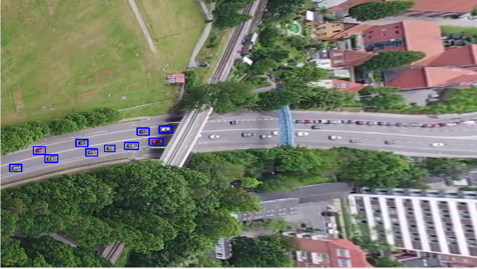

# Welcome to my portfolio page &nbsp;  &nbsp;  &nbsp; 

My name is Bálint, I'm an Engineer with a focus on Robotics. I develop software × hardware solutions for industrial, mobile, and aerial robotics. See visualization:

&nbsp; | Software | Hardware
:-:|:-:|:-:
Industrial | X | -
Mobile | X | x
Aerial | X | x

## Projects

Micro Mouse Challenge &nbsp;  &nbsp; 

- Custom 3D printed parts
- Custom PCB
- Teensy board
- DC motors × MOSFET PWM control
- Bluetooth debugging
- SLAM and Path planning
- Real-time control with sensors
- C++ (Embedded)

---

Robotics and Computer Vision Semester Project &nbsp; 

- Simulated workcell with robot, camera, passive objects  
  
- 2D -> 3D pose estimation using RGB template matching  
  
- 3D pose estimation using point cloud from depth sensor  
  
  
- Benchmarking artificial noise profiles  
  
  
- Path planning using RRT Connect, optimization  
  
  
- Interpolation
- Reachability optimization
- Integration with user interface
- RobWork, OpenCV, Point Cloud Library, C++

---

Traffic Analysis Computer Vision Project ([source](https://github.com/balintmaci/Traffic-Analysis-Computer-Vision))

- Real-time video processing
- Homography transform
- Advanced filtering
- Clustering
- Tracking
- OpenCV, Python

---

Cryptograhpy Challenge ([source](https://github.com/balintmaci/Cryptography-Challenge))

- Examples for encryption
- Examples on breaking them
- C#.NET

---

[Game: Dodge The Creeps](DodgeTheCreeps/DodgeTheCreeps.html)

## Skills

Robotics × System Architecture × Software Development × Engineering  
Control Systems × Automation × Computer Vision × Deep Learning × FPGA  
ROS × PX4 × Linux × Arduino × Embedded Systems × Git × Cmake × OpenCV × Godot × Node.js × Angular × Vivado/HLS  
Python × C++ × TypeScript × Java × C# × GDScript × Juypter × Javascript × VHDL

## Experience

- 4 years @ OnRobot
  - Planning software architecture
  - Development of software components for robotic tools
    - Control software
    - Communication software
    - User interaction software
- 2 years as a freelance engineer
  - Working with various companies as clients
  - Embedded software
  - Mechanical engineering
  - Web based solutions

## Education

- MSc in Robotics from SDU, Denmark
- BSc in Mechatronics from BME, Hungary
