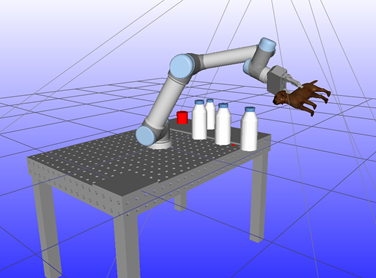
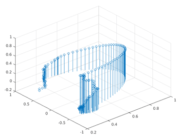
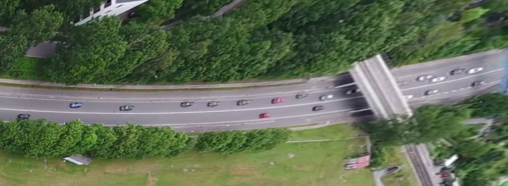
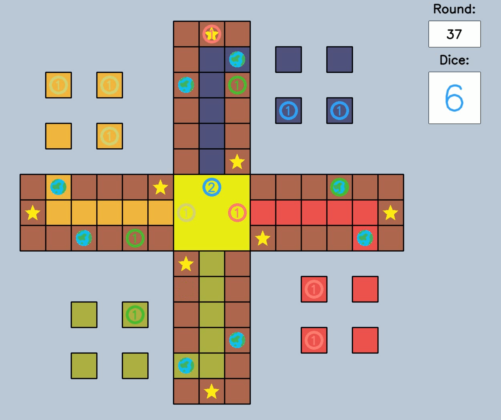
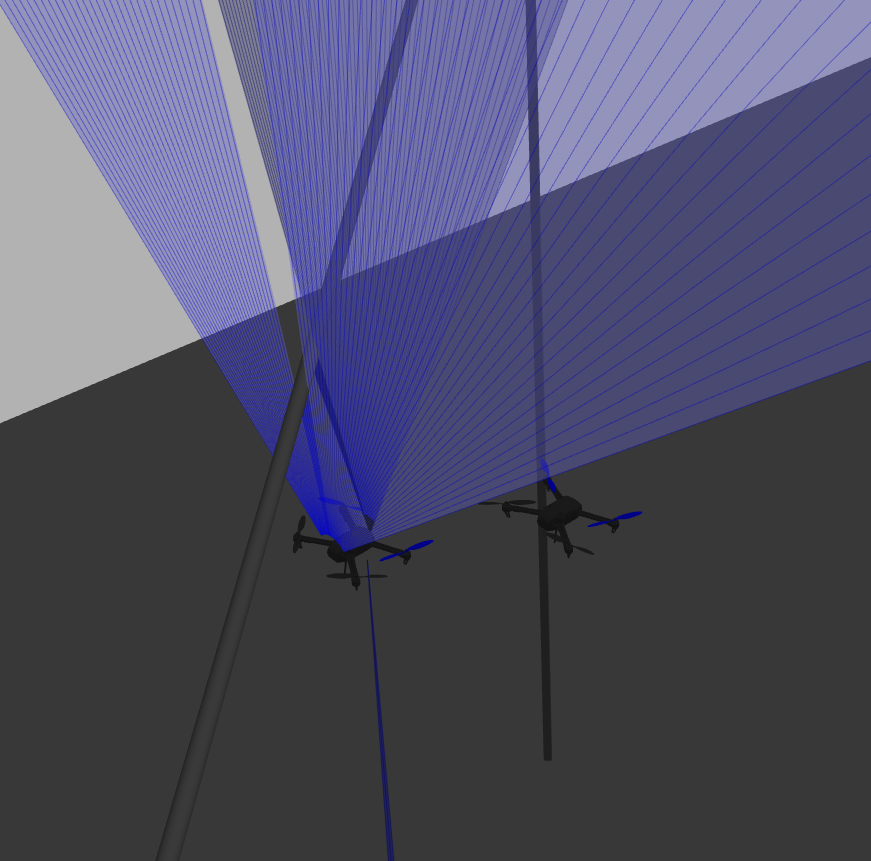
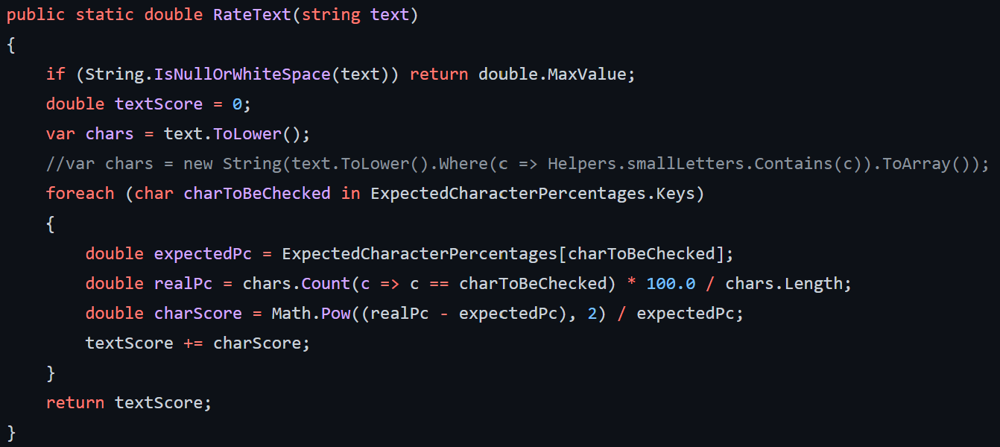

# Balint's Portfolio &nbsp;  &nbsp;  &nbsp; 

Here you can find some of my projects, a list curated by me, for you. Please notice the clickable icons for all my open source repositories, my LinkedIn page, my e-mail address, several project videos, publications, and more sources. The list contains several interesting projects visualized via video, still images, or even interactive demo. In addition to the visualization, the bullet points summarize the main features of each project in a concise manner. At the end of the list, there is a short collection of runner ups. Without further ado, please enjoy.

## Projects

Autonomous Drone Landing Using Vision &nbsp;  &nbsp; 

  

- ROS, PX4, DPU, PYNQ, ZMQ, Python, Jupyter
- Deep Neural Network object detection
- Visual servo using image recognition
- Computation accelerated with low power FPGA
- All computation onboard, standalone autonomous operation
- [IEEE Publication](https://findresearcher.sdu.dk:8443/ws/portalfiles/portal/191669888/MPDrone_CR.pdf)

---

Micro Mouse Challenge &nbsp;  &nbsp; 

  

- Custom 3D printed parts, custom PCB, Teensy MCU
- DC motors × MOSFET PWM control
- Bluetooth debugging
- SLAM and Path planning
- Real-time control with sensors
- C++ (Embedded)

---

Robotics and Computer Vision Semester Project &nbsp; 

- Simulated workcell with robot, camera, passive objects  
  
- 2D -> 3D pose estimation using RGB template matching  
  
- 3D pose estimation using point cloud from depth sensor  
  
  
- Benchmarking artificial noise profiles  
  
  
- Path planning using RRT Connect, optimization  
  
  
- Interpolation
- Reachability optimization
- Integration with user interface
- RobWork, OpenCV, Point Cloud Library, C++

---

Traffic Analysis Computer Vision Project &nbsp; 

   &nbsp;  &nbsp;  &nbsp;  &nbsp; 

- Real-time video processing
- Homography transform
- Advanced filtering
- Clustering
- Tracking
- OpenCV, ROS, Python

---

Sokoban Solver LEGO Mindstorms &nbsp;  &nbsp; 

  

- Controller with sensor feedback, Python
- Optimal path planning, A*, C++

---

Ludo AI Player &nbsp; 

  

- Fully connect neural network implementation in Python
- Reinforcement learning in simulated matches against other artificial participants

---

Drone Swarm Alignment Project &nbsp; 

  

- ROS, PX4, MAVROS, Python
- Gazebo simulation
- Control using radial distance sensors

---

Dodge The Creeps &nbsp; 

  

- Simple browser/mobile game
- Made in Godot
- Motion, Animation, Music, Sound FX, Enemies, Score

---

Cryptograhpy Challenge &nbsp; 

  

- Examples for encryption
- Examples on breaking them
- C#.NET

---

Other Projects

- Webstore configuration and related applications for retail
- [Marker based autonomous drone landing in simulation](https://github.com/balintmaci/Pumpkin-Counter)
- [Drone footage computer vision pumpkin counter](https://github.com/balintmaci/Pumpkin-Counter)
- [OcTree generator with data payload, full custom implementation](https://github.com/balintmaci/Octree-Generator)
- [3D FPS game in Godot engine](https://github.com/balintmaci/FPS-Game-Godot-Tutorial)
- [Python based automated video player](https://github.com/balintmaci/Python-Video-Player)
- [Python Django web service](https://github.com/balintmaci/django-data-query)
- [Python Kivy GUI app](https://github.com/balintmaci/Python-Gui-App)
- Automated PowerPoint presentation, C#.NET
- [Scripts for advanced Windows Speech Recognition Macros](https://github.com/balintmaci/Sample-Windows-Speech-Recognition-Macros)
- [FPGA controlled battery charger](https://github.com/balintmaci/FPGA-Battery-Charger-Robot-Electronics-Semester-Project)
- Motorized stereo camera setup
